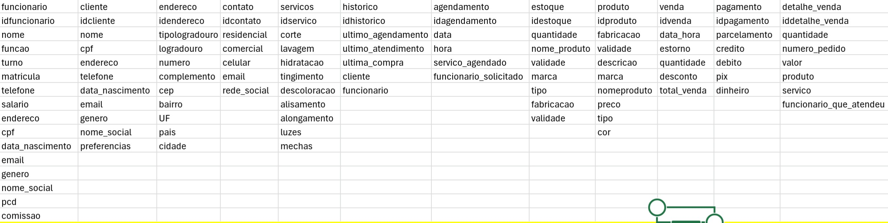
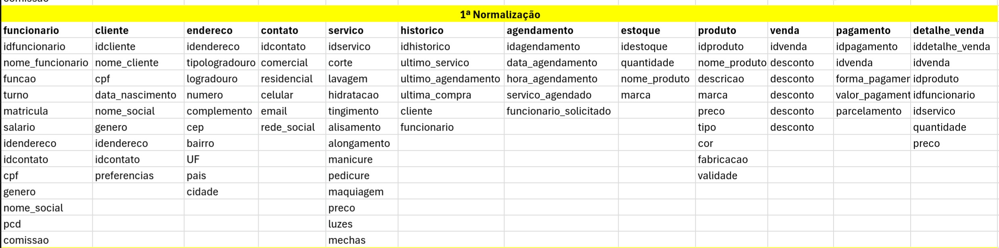
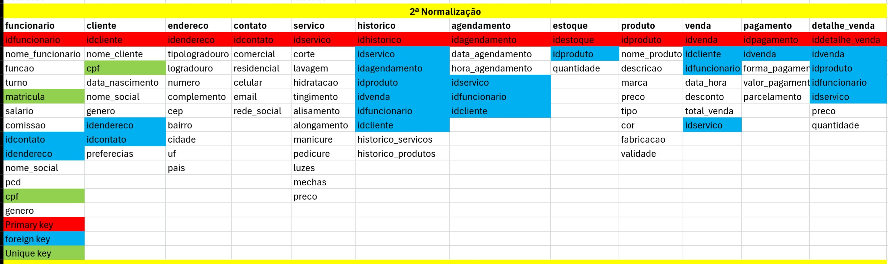
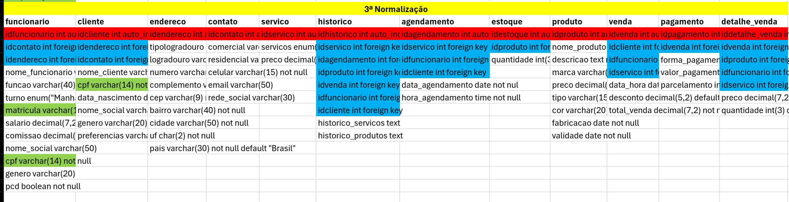
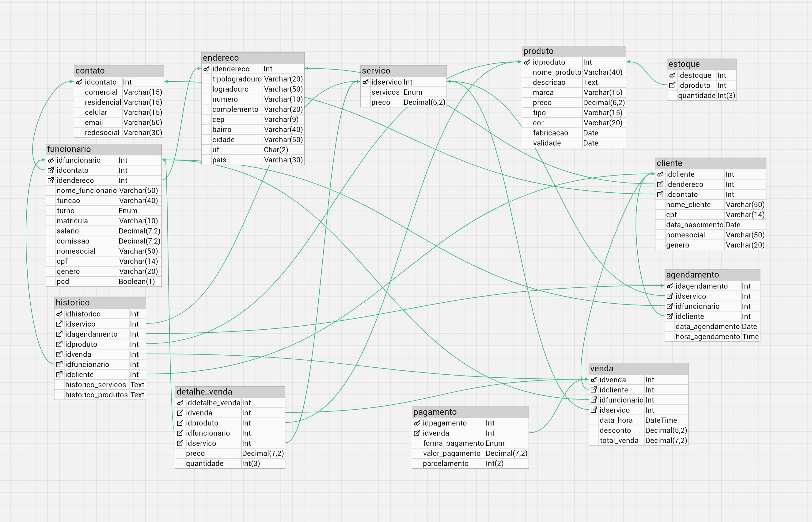

# Estudo de Caso: Salão de Cabeleireiro "Cabelos Incríveis"
### Contexto:
O salão de cabeleireiro "Cabelos Incríveis" é um estabelecimento localizado em uma 
área movimentada da cidade. O salão oferece uma variedade de serviços, incluindo 
cortes de cabelo, coloração, tratamentos capilares, manicure e pedicure. Eles têm uma 
equipe de cabeleireiros talentosos e uma base de clientes fiéis.
Desafio:
O salão de cabeleireiro "Cabelos Incríveis" está enfrentando dificuldades para gerenciar 
eficientemente seus clientes, agendamentos, estoque de produtos e informações dos 
funcionários. Eles precisam de um sistema de banco de dados para ajudar a organizar e
automatizar esses processos.
Requisitos do Sistema:
• Gerenciamento de Clientes:
o Cadastro de novos clientes com informações como nome, endereço, 
telefone, e-mail, preferências de serviços, histórico de serviços realizados, 
etc.
o Registro de serviços realizados por cada cliente, incluindo datas, tipos de 
serviço, cabeleireiro responsável, etc.
o Possibilidade de atualização e exclusão de informações de clientes.
• Agendamento de Serviços:
o Capacidade de agendar serviços para clientes, incluindo data, horário, tipo 
de serviço, cabeleireiro responsável, etc.
o Visualização rápida de disponibilidade de horários e cabeleireiros para 
agendamentos.
• Gerenciamento de Estoque:
o Controle de estoque de produtos utilizados no salão, como tinturas, 
shampoos, condicionadores, etc.
o Registro de entrada e saída de produtos, incluindo quantidades e datas.
• Informações dos Funcionários:
o Cadastro de informações dos funcionários, incluindo nome, função, 
horário de trabalho, salário, etc.
o Atribuição de serviços realizados por cada funcionário e 
acompanhamento de seu desempenho.
Modelo Lógico do Banco de Dados:
Baseado nos requisitos acima, podemos definir um modelo lógico básico para o banco 
de dados do salão de cabeleireiro "Cabelos Incríveis". Aqui está um esboço simplificado:
• Tabelas:
o Clientes
▪ Cliente_ID (Chave Primária)
▪ Nome
▪ Endereço
▪ Telefone
▪ E-mail
▪ Preferências
o Serviços
▪ Serviço_ID (Chave Primária)
▪ Tipo
▪ Descrição
▪ Preço
o Agendamentos
▪ Agendamento_ID (Chave Primária)
▪ Cliente_ID (Chave Estrangeira referenciando a tabela Clientes)
▪ Serviço_ID (Chave Estrangeira referenciando a tabela Serviços)
▪ Data
▪ Horário
▪ Cabeleireiro
o Estoque
▪ Produto_ID (Chave Primária)
▪ Nome
▪ Quantidade
▪ Data_Entrada
▪ Data_Saída
o Funcionários
▪ Funcionário_ID (Chave Primária)
▪ Nome
▪ Função
▪ Horário_Trabalho
▪ Salário

## Modelo lógico:

### 1ª Normalização

### 2ª Normalização

### 3ª Normalização

## Modelo conceitual:

## Modelo físico
#### Código escrito em sql

ˋˋˋsql
create database cabelosincriveisdb;
use cabelosincriveis;

DROP TABLE IF EXISTS endereco;
DROP TABLE IF EXISTS contato;
DROP TABLE IF EXISTS servico;
DROP TABLE IF EXISTS produto;
DROP TABLE IF EXISTS funcionario;
DROP TABLE IF EXISTS cliente;
DROP TABLE IF EXISTS historico;
DROP TABLE IF EXISTS agendamento;
DROP TABLE IF EXISTS estoque;
DROP TABLE IF EXISTS venda;
DROP TABLE IF EXISTS pagamento;
DROP TABLE IF EXISTS detalhe_venda;

CREATE TABLE endereco (
idendereco INT PRIMARY KEY AUTO_INCREMENT NOT NULL,
tipologradouro VARCHAR(20) NOT NULL DEFAULT 'not null',
logradouro VARCHAR(50) NOT NULL DEFAULT 'not null',
numero VARCHAR(10) NOT NULL DEFAULT 'not null',
complemento VARCHAR(20) NOT NULL,
cep VARCHAR(9) NOT NULL DEFAULT 'not null',
bairro VARCHAR(40) NOT NULL DEFAULT 'not null',
cidade VARCHAR(50) NOT NULL DEFAULT 'not null',
uf CHAR(2) NOT NULL DEFAULT 'not null',
pais VARCHAR(30) NOT NULL DEFAULT '"Brasil"');

CREATE TABLE contato (
idcontato INT PRIMARY KEY AUTO_INCREMENT NOT NULL,
comercial VARCHAR(15) NOT NULL,
residencial VARCHAR(15) NOT NULL,
celular VARCHAR(15) NOT NULL DEFAULT 'not null',
email VARCHAR(50) NOT NULL,
redesocial VARCHAR(30) NOT NULL);

CREATE TABLE servico (
idservico INT PRIMARY KEY AUTO_INCREMENT NOT NULL,
servicos ENUM ("corte","lavagem","hidratacao","coloracao","alisamento","alongamento","luzes","mechas","manicure","pedicure") NOT NULL DEFAULT not null,
preco DECIMAL(6,2) NOT NULL DEFAULT not null);

CREATE TABLE produto (
idproduto INT PRIMARY KEY AUTO_INCREMENT NOT NULL,
nome_produto VARCHAR(40) NOT NULL DEFAULT 'not null',
descricao TEXT NOT NULL DEFAULT 'not null',
marca VARCHAR(15) NOT NULL DEFAULT 'not null',
preco DECIMAL(6,2) NOT NULL DEFAULT not null,
tipo VARCHAR(15) NOT NULL DEFAULT 'not null',
cor VARCHAR(20) NOT NULL DEFAULT 'not null',
fabricacao DATE NOT NULL DEFAULT not null,
validade DATE NOT NULL DEFAULT not null);

CREATE TABLE funcionario (
idfuncionario INT PRIMARY KEY AUTO_INCREMENT NOT NULL,
idcontato INT NOT NULL,
idendereco INT NOT NULL,
nome_funcionario VARCHAR(50) NOT NULL DEFAULT 'not null',
funcao VARCHAR(40) NOT NULL DEFAULT 'not null',
turno ENUM ("Manhã","Tarde","Noite","Integral") NOT NULL DEFAULT not null,
matricula VARCHAR(10) NOT NULL UNIQUE DEFAULT 'not null',
salario DECIMAL(7,2) NOT NULL DEFAULT not null,
comissao DECIMAL(7,2),
nomesocial VARCHAR(50),
cpf VARCHAR(14) NOT NULL UNIQUE DEFAULT 'not null',
genero VARCHAR(20) NOT NULL,
pcd BOOLEAN(1) NOT NULL DEFAULT not null);

CREATE TABLE cliente (
idcliente INT PRIMARY KEY AUTO_INCREMENT NOT NULL,
idendereco INT NOT NULL,
idcontato INT NOT NULL,
nome_cliente VARCHAR(50) NOT NULL DEFAULT 'not null',
cpf VARCHAR(14) NOT NULL UNIQUE,
data_nascimento DATE NOT NULL DEFAULT not null,
nomesocial VARCHAR(50),
genero VARCHAR(20));

CREATE TABLE historico (
idhistorico INT PRIMARY KEY AUTO_INCREMENT NOT NULL,
idservico INT NOT NULL,
idagendamento INT NOT NULL,
idproduto INT NOT NULL,
idvenda INT NOT NULL,
idfuncionario INT NOT NULL,
idcliente INT NOT NULL,
historico_servicos TEXT,
historico_produtos TEXT);

CREATE TABLE agendamento (
idagendamento INT PRIMARY KEY AUTO_INCREMENT NOT NULL,
idservico INT NOT NULL,
idfuncionario INT NOT NULL,
idcliente INT NOT NULL,
data_agendamento DATE NOT NULL DEFAULT not null,
hora_agendamento TIME NOT NULL DEFAULT not null);

CREATE TABLE estoque (
idestoque INT PRIMARY KEY AUTO_INCREMENT NOT NULL,
idproduto INT NOT NULL,
quantidade INT(3) NOT NULL DEFAULT not null);

CREATE TABLE venda (
idvenda INT PRIMARY KEY AUTO_INCREMENT NOT NULL,
idcliente INT NOT NULL,
idfuncionario INT NOT NULL,
idservico INT NOT NULL,
data_hora DATETIME NOT NULL DEFAULT current_timestamp(),
desconto DECIMAL(5,2) DEFAULT default 0,
total_venda DECIMAL(7,2) NOT NULL DEFAULT not null);

CREATE TABLE pagamento (
idpagamento INT PRIMARY KEY AUTO_INCREMENT NOT NULL,
idvenda INT NOT NULL,
forma_pagamento ENUM ("Dinheiro","Débito","Pix","Crédito") NOT NULL DEFAULT not null,
valor_pagamento DECIMAL(7,2) NOT NULL DEFAULT not null,
parcelamento INT(2) NOT NULL DEFAULT 1);

CREATE TABLE detalhe_venda (
iddetalhe_venda INT PRIMARY KEY AUTO_INCREMENT NOT NULL,
idvenda INT NOT NULL,
idproduto INT NOT NULL,
idfuncionario INT NOT NULL,
idservico INT NOT NULL,
preco DECIMAL(7,2) NOT NULL,
quantidade INT(3) NOT NULL DEFAULT 1);

ALTER TABLE funcionario ADD CONSTRAINT funcionario_idcontato_contato_idcontato FOREIGN KEY (idcontato) REFERENCES contato(idcontato);
ALTER TABLE funcionario ADD CONSTRAINT funcionario_idendereco_endereco_idendereco FOREIGN KEY (idendereco) REFERENCES endereco(idendereco);
ALTER TABLE cliente ADD CONSTRAINT cliente_idendereco_endereco_idendereco FOREIGN KEY (idendereco) REFERENCES endereco(idendereco);
ALTER TABLE cliente ADD CONSTRAINT cliente_idcontato_contato_idcontato FOREIGN KEY (idcontato) REFERENCES contato(idcontato);
ALTER TABLE historico ADD CONSTRAINT historico_idservico_servico_idservico FOREIGN KEY (idservico) REFERENCES servico(idservico);
ALTER TABLE historico ADD CONSTRAINT historico_idagendamento_agendamento_idagendamento FOREIGN KEY (idagendamento) REFERENCES agendamento(idagendamento);
ALTER TABLE historico ADD CONSTRAINT historico_idproduto_produto_idproduto FOREIGN KEY (idproduto) REFERENCES produto(idproduto);
ALTER TABLE historico ADD CONSTRAINT historico_idvenda_venda_idvenda FOREIGN KEY (idvenda) REFERENCES venda(idvenda);
ALTER TABLE historico ADD CONSTRAINT historico_idfuncionario_funcionario_idfuncionario FOREIGN KEY (idfuncionario) REFERENCES funcionario(idfuncionario);
ALTER TABLE historico ADD CONSTRAINT historico_idcliente_cliente_idcliente FOREIGN KEY (idcliente) REFERENCES cliente(idcliente);
ALTER TABLE agendamento ADD CONSTRAINT agendamento_idservico_servico_idservico FOREIGN KEY (idservico) REFERENCES servico(idservico);
ALTER TABLE agendamento ADD CONSTRAINT agendamento_idfuncionario_funcionario_idfuncionario FOREIGN KEY (idfuncionario) REFERENCES funcionario(idfuncionario);
ALTER TABLE agendamento ADD CONSTRAINT agendamento_idcliente_cliente_idcliente FOREIGN KEY (idcliente) REFERENCES cliente(idcliente);
ALTER TABLE estoque ADD CONSTRAINT estoque_idproduto_produto_idproduto FOREIGN KEY (idproduto) REFERENCES produto(idproduto);
ALTER TABLE venda ADD CONSTRAINT venda_idcliente_cliente_idcliente FOREIGN KEY (idcliente) REFERENCES cliente(idcliente);
ALTER TABLE venda ADD CONSTRAINT venda_idfuncionario_funcionario_idfuncionario FOREIGN KEY (idfuncionario) REFERENCES funcionario(idfuncionario);
ALTER TABLE venda ADD CONSTRAINT venda_idservico_servico_idservico FOREIGN KEY (idservico) REFERENCES servico(idservico);
ALTER TABLE pagamento ADD CONSTRAINT pagamento_idvenda_venda_idvenda FOREIGN KEY (idvenda) REFERENCES venda(idvenda);
ALTER TABLE detalhe_venda ADD CONSTRAINT detalhe_venda_idvenda_venda_idvenda FOREIGN KEY (idvenda) REFERENCES venda(idvenda);
ALTER TABLE detalhe_venda ADD CONSTRAINT detalhe_venda_idproduto_produto_idproduto FOREIGN KEY (idproduto) REFERENCES produto(idproduto);
ALTER TABLE detalhe_venda ADD CONSTRAINT detalhe_venda_idfuncionario_funcionario_idfuncionario FOREIGN KEY (idfuncionario) REFERENCES funcionario(idfuncionario);
ALTER TABLE detalhe_venda ADD CONSTRAINT detalhe_venda_idservico_servico_idservico FOREIGN KEY (idservico) REFERENCES servico(idservico);

ˋˋˋ

